# Soft_HuaRong-Road
AI算法使用方法
准备工作：
将shiyan.py和isSame.py放在无框字符所在目录下（如图）
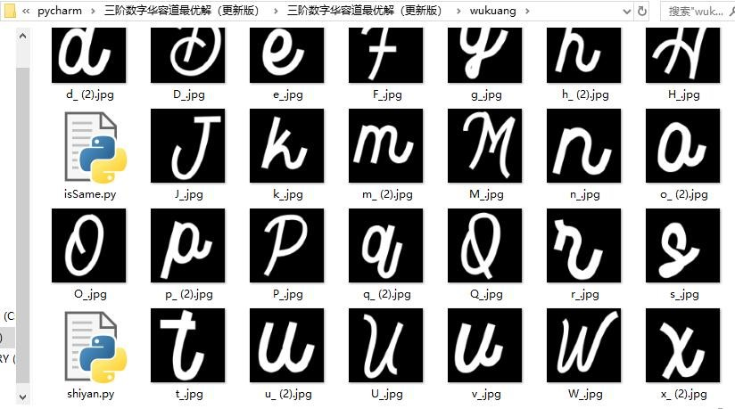
在无框字符所在目录下创建文件夹cut，保存找到的新图
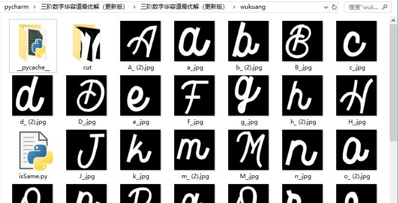
运行代码：
1.	运行base64.py，将图片解码，并存到本地
2.	运行cutting.py，切割完成的图片与乱序的整图在同一个文件夹（图片处已删除原图片）
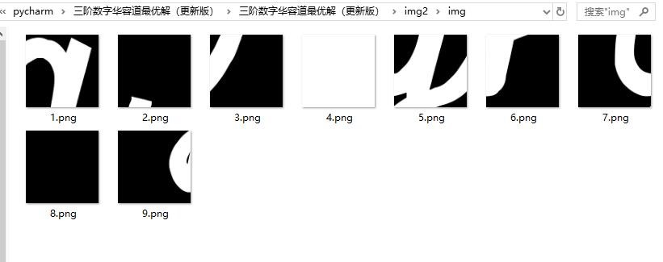
3.	运行shiyan.py，命令行中生成图片名称，及待解数组，对应原图自动切割后保存到cut中
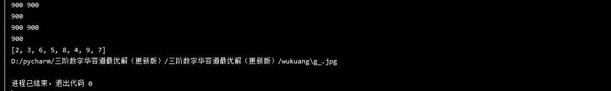
（注：待解数组排列出来的矩阵，是按顺序的。
eg:图片的数组[2, 3, 6, 5, 8, 4, 9, 7]，空格在第3位,对应数值是1，则矩阵为	[[2,3,1],[6,5,8],[4,9,7]]）
4.	修改Generator.py中的标注部分，为空格对应的值（上例为1）
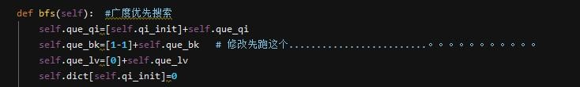
（self.que_bk=[1-1]，修改前面的数值），运行
5.	修改Qian.py
修改空格位置，改为乱序矩阵对应的空格的值的位置坐标（上例为0  2）

修改图示两处为空格位置的值（上例为1）

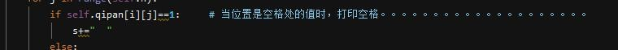
修改强制交换的步数（上例为13）
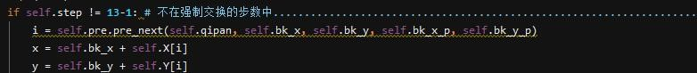
6.	修改Predition.py，（上例为1）
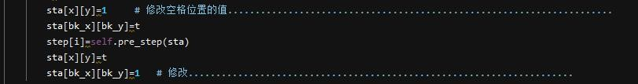
7.	运行MyFrame.py
在显示框中点击“开始”，命令行弹出输入数组，回车运行
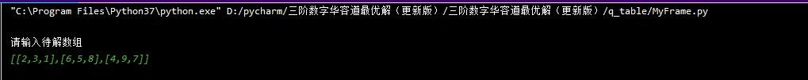
到达强制交换处，输入要交换的坐标值（上例交换1  9，则输入0 0，2 2），回车继续
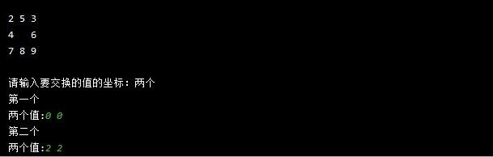
若无解强制交换，流程一样
8.	最后输出移动字符串
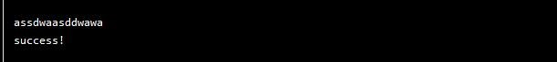
